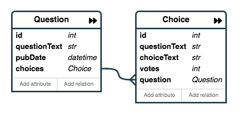

# 模型的创建及使用

Django 框架使用类似与 MVC 模式的方式进行信息的处理，在模型（model）中存储数据和处理数据，和数据库进行交互，因此需要配置数据库、时区等等必要信息。这些信息可通过项目的配置模块 `settings.py` 文件进行设置。

## 配置项目信息

### 设置时区

打开项目中的 `settings.py` 文件，修改其中的时区设置信息：

```python
TIME_ZONE = 'Asia/Shanghai'
```

现在启动Django内置服务器，可以看到，项目的时间不再是UTC时间，而是本地时间了。

### 设置数据库信息

Django 的默认数据库为 SQLite，无需额外安装软件和库，直接可以使用。当然，我们也可以使用其它的数据库存储信息。在学习阶段，我们先使用默认 SQLite 作为数据库，将学习重点先放到模型的创建和使用上来。所以，我们保持数据库的默认设置不变。

```python
DATABASES = {
    'default': {
        'ENGINE': 'django.db.backends.sqlite3',
        'NAME': os.path.join(BASE_DIR, 'db.sqlite3'),
    }
}
```

## 创建模型

模型是真实数据的简单明确的描述。它包含了储存的数据所必要的字段和行为。我们想开发的投票app需要问题（Question）和选项（Choice）两个模型，问题模型包括问题描述、发布时间，选项模型需要选项描述和当前票数。每个选项属于一个问题。模型数据关系图[^1]如下：



在应用的`model.py`中写入如下代码：

```python
from django.db import models

class Question(models.Model):
    question_text = models.CharField(max_length=200)
    pub_date = models.DateTimeField('date published')

class Choice(models.Model):
    question = models.ForeignKey(Question, on_delete=models.CASCADE)
    choice_text = models.CharField(max_length=200)
    votes = models.IntegerField(default=0)
```

上述代码的作用，就是设置数据库中表的字段信息（字段名称、字段类型、字段属性等等）。

## 激活模型

有了字段信息，可以使用Django提供的指令，生成数据模型。

```bash
python manage.py makemigrations polls
```

你将会看到类似于下面这样的输出：

```bash
Migrations for 'polls':
  polls/migrations/0001_initial.py:
    - Create model Choice
    - Create model Question
```

通过运行 `makemigrations` 命令，Django 会检测你对模型文件的修改（在这种情况下，你已经取得了新的），并且把修改的部分储存为一次**迁移**。所谓迁移，就是数据库结构变化的储存形式。

但是我们发现内置服务器输出一些警告信息：

```bash
You have 17 unapplied migration(s). Your project may not work properly until you apply the migrations for app(s): admin, auth, contenttypes, sessions.
Run 'python manage.py migrate' to apply them.
```

以上信息的意思是项目有一些迁移，但这些迁移没有执行，可能对运行产生影响。要执行迁移，就需要使用`migrate`指令：

```bash
python manage.py migrate
```

在终端可以看到输出如下信息：

```bash
python manage.py migrate
Operations to perform:
  Apply all migrations: admin, auth, contenttypes, sessions
Running migrations:
  Applying contenttypes.0001_initial... OK
  Applying auth.0001_initial... OK
  Applying admin.0001_initial... OK
  Applying admin.0002_logentry_remove_auto_add... OK
  Applying admin.0003_logentry_add_action_flag_choices... OK
  Applying contenttypes.0002_remove_content_type_name... OK
  Applying auth.0002_alter_permission_name_max_length... OK
  Applying auth.0003_alter_user_email_max_length... OK
  Applying auth.0004_alter_user_username_opts... OK
  Applying auth.0005_alter_user_last_login_null... OK
  Applying auth.0006_require_contenttypes_0002... OK
  Applying auth.0007_alter_validators_add_error_messages... OK
  Applying auth.0008_alter_user_username_max_length... OK
  Applying auth.0009_alter_user_last_name_max_length... OK
  Applying auth.0010_alter_group_name_max_length... OK
  Applying auth.0011_update_proxy_permissions... OK
  Applying sessions.0001_initial... OK
```

现在再启动内置服务器，之前的相关警告信息消失了。

## 数据库的生成与迁移

迁移是非常强大的功能，它能让你在开发过程中持续的改变数据库结构而不需要重新删除和创建表，迁移使得开发人员专注于使数据库平滑升级而不会丢失数据。改变模型需要这三步：

1. 编辑 `models.py` 文件，改变模型。
1. 运行 `python manage.py makemigrations` 为模型的改变生成迁移文件。
1. 运行 `python manage.py migrate` 来应用数据库迁移。

数据库迁移被分解成生成和应用两个命令是为了让你能够在代码控制系统上提交迁移数据并使其能在多个应用里使用；这不仅仅会让开发更加简单，也给别的开发者和生产环境中的使用带来方便。

## 参考资料

1. [数据库配置及模型创建](https://docs.djangoproject.com/zh-hans/2.2/intro/tutorial02/)

[^1]: 模型实体关系图使用[PonyORM在线编辑工具](https://editor.ponyorm.com)制作。
